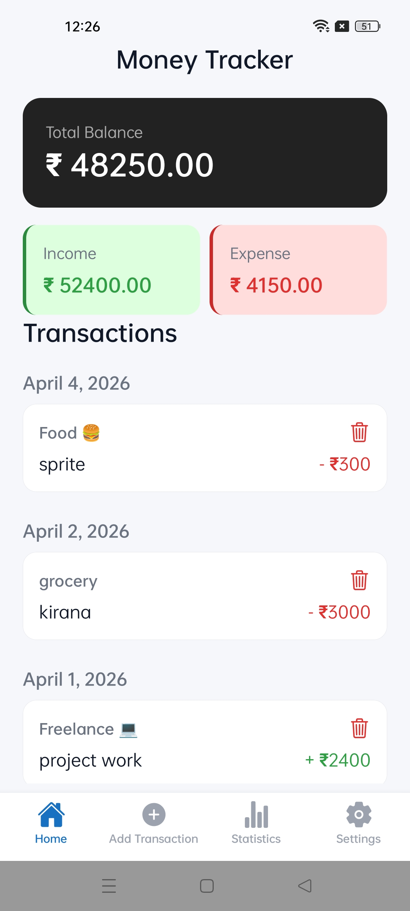
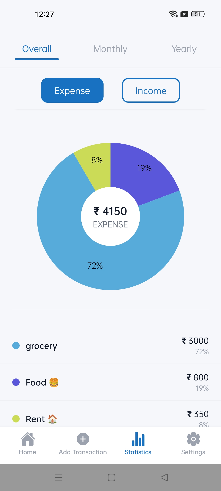
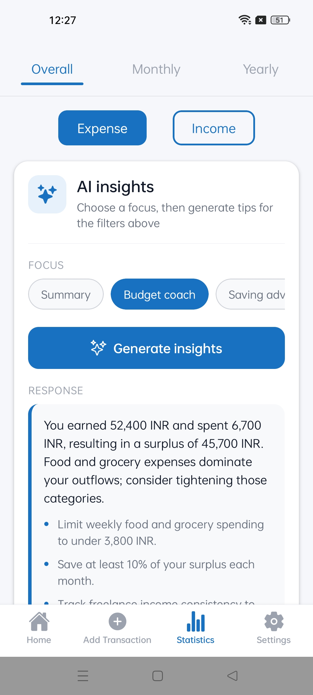

<div align="center">


# Money App

**AI-powered personal finance manager for Android, iOS & Web**

[](https://expo.dev)
[](https://reactnative.dev)
[](https://www.typescriptlang.org)
[](https://supabase.com)
[](./LICENSE)

[Features](#-features) · [Screenshots](#-screenshots) · [Architecture](#-architecture) · [Getting Started](#-getting-started) · [Contributing](#-contributing)

</div>

---

## Overview

Money App is a production-grade personal finance tracker built with **React Native + Expo**. It goes beyond simple expense logging — at its core is an **AI agent** that analyzes your spending patterns, delivers actionable budget insights, and coaches you toward your savings goals.

Designed with a privacy-first approach, all transaction data is owned by the user and securely synced via Supabase. The app works fully offline and is deployable to Android, iOS, and the web from a single codebase.

---

## Features

### AI-Powered Finance Agent
The standout capability of Money App is its embedded AI layer, powered by OpenRouter's LLM API. The agent:

- Generates natural-language **spending summaries** at the end of each month
- Provides **budget coaching** — flags overspending categories and suggests adjustments
- Delivers **personalized saving tips** based on your actual transaction history
- Answers ad-hoc finance questions in a conversational interface

### Core Finance Tracking
- Log **income and expense transactions** with categories, dates, notes, and amounts
- Create and manage **custom categories** that fit your lifestyle
- Full **CRUD** on all transactions — edit or delete entries at any time

### Analytics Dashboard
- **Pie charts** broken down by category for monthly, yearly, and all-time views
- **Trend lines** showing income vs. expenses over time
- Key stats: total spend, top categories, average daily spend, savings rate

### Authentication & Cloud Sync
- Secure sign-up / log-in via **Supabase Auth** (email + password, OAuth ready)
- Real-time **cloud sync** across devices
- Row-level security ensures only the authenticated user accesses their data

### Offline-First Architecture
- Transactions can be **added and browsed without internet**
- Local state syncs to Supabase automatically when connectivity is restored

### Theming
- Full **light / dark mode** support
- Persistent theme preference saved per user

---

## Screenshots

| Dashboard | Analytics | AI Insights |
|-----------|-----------|-------------|
|  |  |  |

---

## Architecture

```
Money App
├── Mobile / Web Client  (src/)
│   ├── Authentication       → Supabase Auth (JWT-based)
│   ├── Database             → Supabase Postgres (RLS enforced)
│   ├── State Management     → Zustand (transactionStore, categoryStore)
│   ├── Offline Layer        → localTransactions service + AsyncStorage
│   ├── AI Feature Module    → features/ai — hooks, mappers, types
│   │   ├── Spending Summaries
│   │   ├── Budget Coaching
│   │   └── Savings Tips
│   ├── Charts               → react-native-gifted-charts
│   └── Navigation           → Expo Router (file-based) + @expo/vector-icons
│
└── AI Backend  (backend/)
    ├── Node.js / Express server
    ├── OpenRouter LLM API integration
    └── Deployed on Vercel
```

### Tech Stack

| Layer | Technology |
|---|---|
| Framework | React Native + Expo (SDK 52) |
| Language | TypeScript |
| Navigation | Expo Router (file-based) |
| State | Zustand |
| Backend / Auth | Supabase |
| AI / LLM | OpenRouter API |
| Charts | react-native-gifted-charts |
| Icons | @expo/vector-icons |

---

## Getting Started

### Prerequisites

- Node.js 18+
- Expo CLI — `npm install -g expo-cli`
- A [Supabase](https://supabase.com) project
- An [OpenRouter](https://openrouter.ai) API key

### Installation

```bash
# 1. Clone the repository
git clone https://github.com/your-username/money-app.git
cd money-app

# 2. Install dependencies
npm install
```

### Environment Setup

Create a `.env` file in the project root (or configure `app.json` extra fields):

```env
EXPO_PUBLIC_SUPABASE_URL=https://your-project.supabase.co
EXPO_PUBLIC_SUPABASE_ANON_KEY=your-anon-key
EXPO_PUBLIC_OPENROUTER_API_KEY=your-openrouter-key
EXPO_PUBLIC_AI_BACKEND_URL=https://your-backend.vercel.app
```

### Database Setup

Run the following SQL in your Supabase SQL editor to provision the required tables:

```sql
-- Transactions table
create table transactions (
  id uuid primary key default gen_random_uuid(),
  user_id uuid references auth.users not null,
  type text check (type in ('income', 'expense')) not null,
  amount numeric not null,
  category text not null,
  note text,
  date date not null,
  created_at timestamptz default now()
);

-- Enable Row Level Security
alter table transactions enable row level security;

create policy "Users can manage their own transactions"
  on transactions for all
  using (auth.uid() = user_id);
```

### Running the App

```bash
# Start the development server
npx expo start
```

Then open in:
- **Android** — press `a` or scan QR with Expo Go
- **iOS** — press `i` or scan QR with Expo Go (macOS required for simulator)
- **Web** — press `w`

---


## Roadmap

- [ ] Budget goal setting with progress tracking
- [ ] Recurring transaction support
- [ ] CSV / PDF export
- [ ] Multi-currency support
- [ ] Widgets (iOS / Android home screen)
- [ ] AI-generated monthly finance reports

---

## Contributing

Contributions are welcome. To propose a significant change, please open an issue first to discuss the approach.

```bash
# Fork the repo, then:
git checkout -b feature/your-feature-name
git commit -m "feat: describe your change"
git push origin feature/your-feature-name
# Open a Pull Request
```

Please follow the existing code style (TypeScript strict mode, ESLint config) and include relevant tests where applicable.

---

## License

Distributed under the MIT License. See [`LICENSE`](./LICENSE) for details.

---

<div align="center">
  <sub>Built with React Native + Expo · Powered by Supabase & OpenRouter</sub>
</div>
